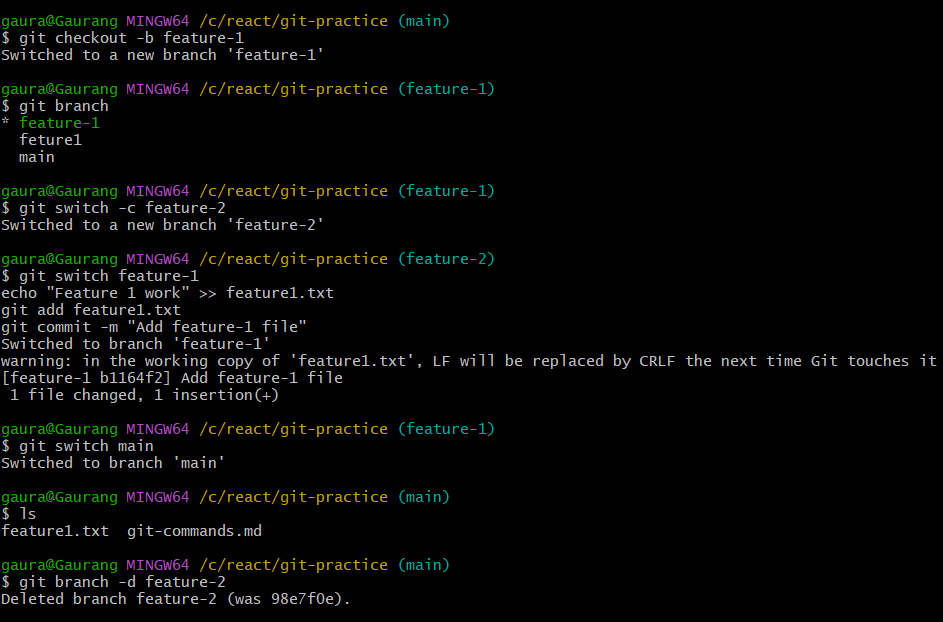
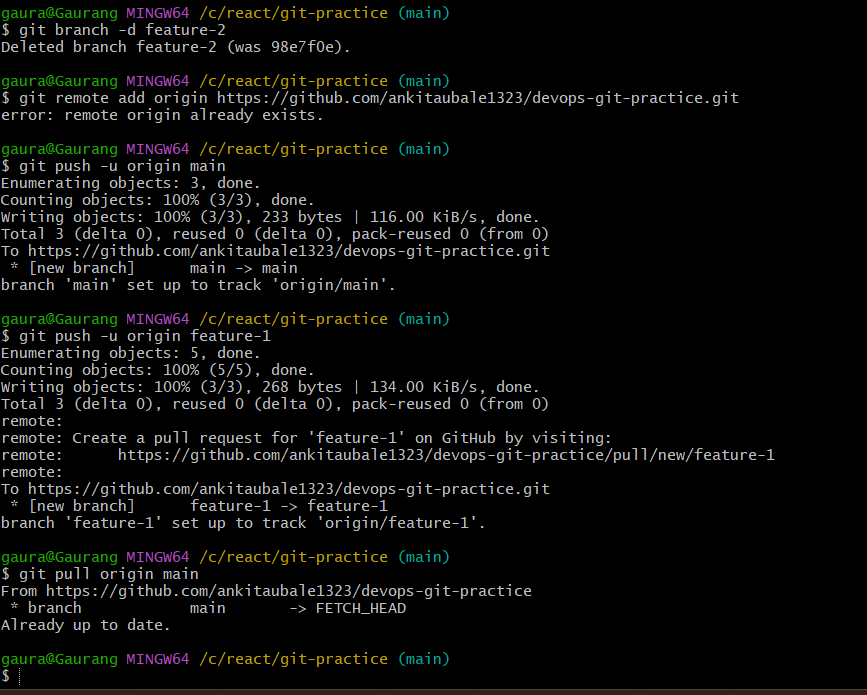
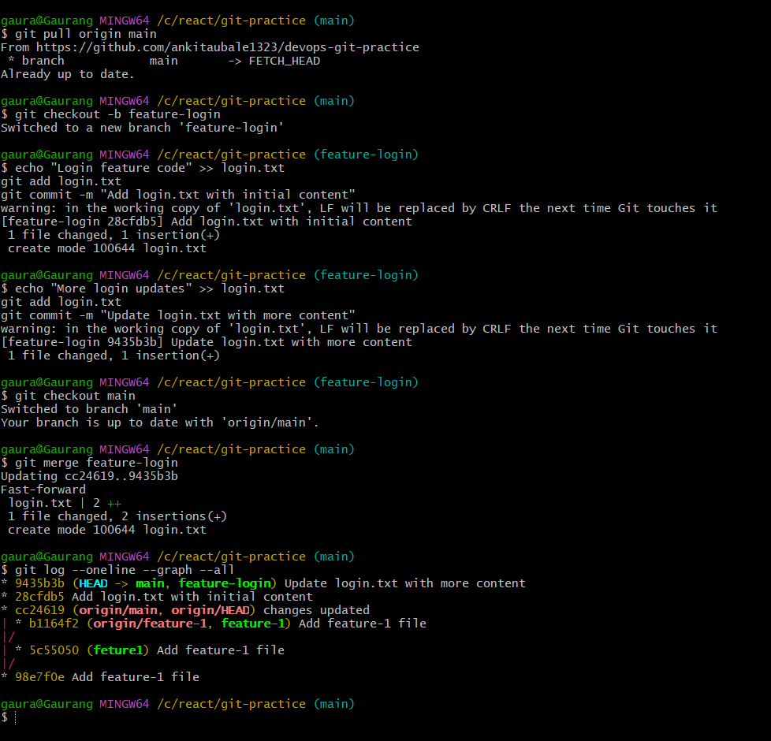
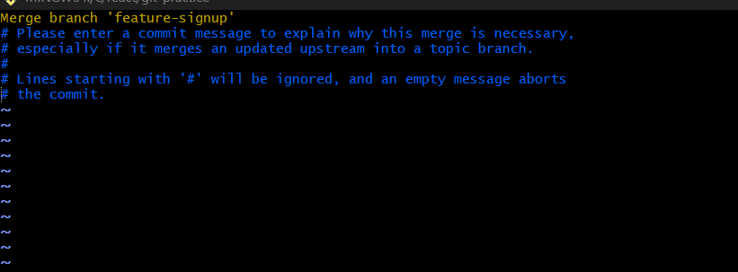
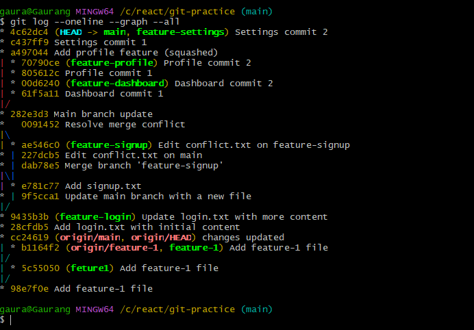
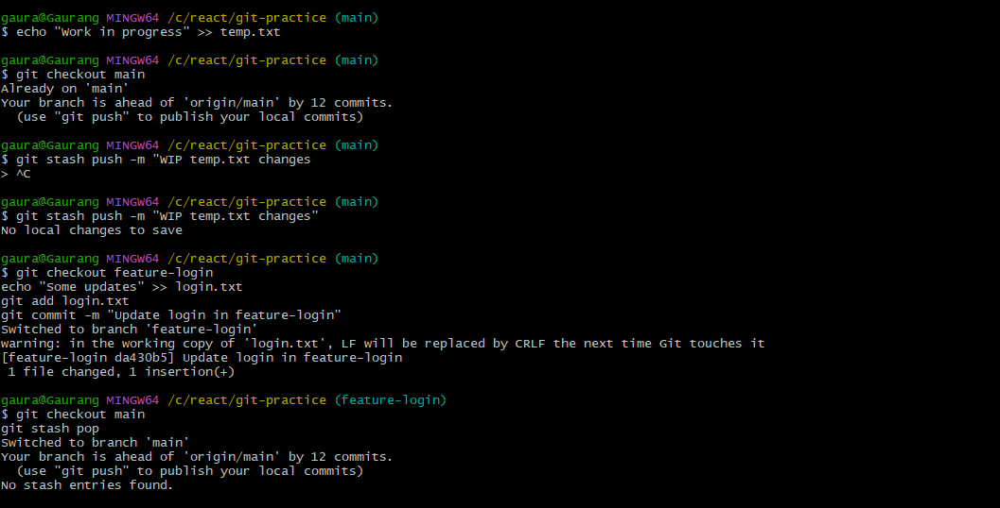
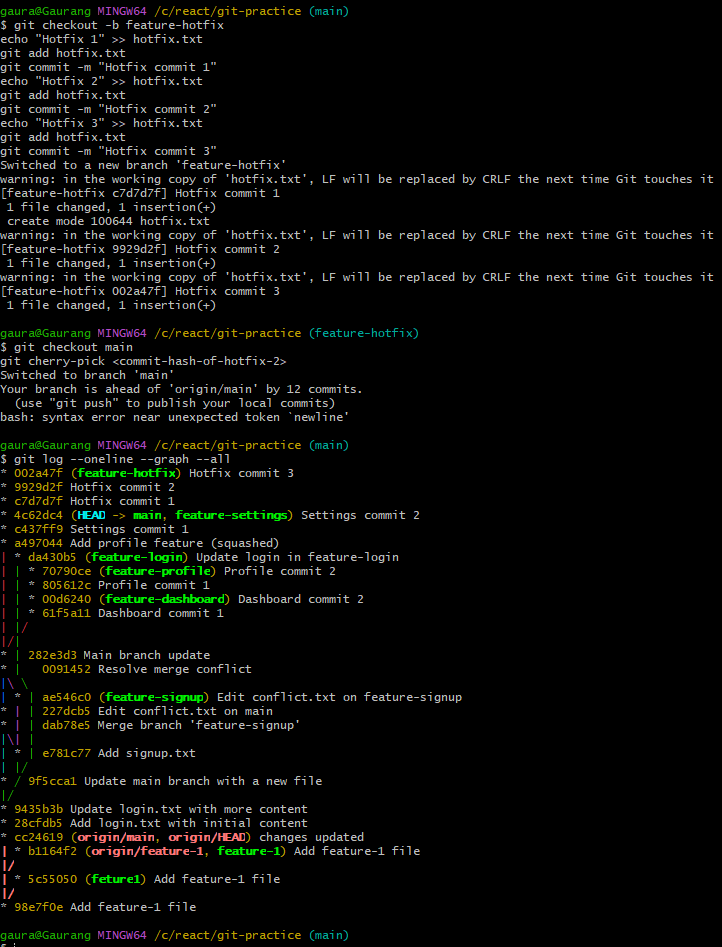

# day-23-notes.md

## Task 1: Understanding Branches

1. **What is a branch in Git?**
   A branch in Git is a separate line of development. It allows you to work on a feature, fix, or experiment independently from the `main` branch. Each branch has its own history of commits.

2. **Why do we use branches instead of committing everything to `main`?**

* To keep `main` stable and clean.
* To work on features or bug fixes without affecting others.
* To experiment without fear of breaking existing code.
* To collaborate safely in teams.

3. **What is `HEAD` in Git?**
   `HEAD` is a pointer that points to the current commit you are on. Usually, it points to the latest commit of your current branch. When you switch branches, `HEAD` moves to the tip of that branch.

4. **What happens to your files when you switch branches?**
   Git updates the working directory to match the snapshot of the commit the branch points to. Files that differ between branches are changed accordingly. Uncommitted changes may prevent switching.

---

## Task 2: Branching Commands — Hands-On

```bash
# 1. List all branches
git branch

# 2. Create a new branch called feature-1
git branch feature-1

# 3. Switch to feature-1
git switch feature-1

# 4. Create and switch to feature-2 in one command
git switch -c feature-2

# 5. Switch back to main
git switch main

# 6. Make a commit on feature-1 (example)
git switch feature-1
echo "Feature 1 work" >> feature1.txt
git add feature1.txt
git commit -m "Add feature-1 file"

# 7. Switch back to main — commit from feature-1 is not there
git switch main
ls  # feature1.txt does not exist here

# 8. Delete a branch no longer needed
git branch -d feature-2

# 9. Add all branching commands to git-commands.md
# (update your file accordingly)
```


**Note:** `git switch` is the modern alternative to `git checkout` for switching branches. `git checkout` can also be used for creating new branches, but `git switch -c <branch>` is simpler and less error-prone.

---

## Task 3: Push to GitHub

```bash
# 1. Create a new repo on GitHub (no README)
# 2. Connect local repo to GitHub
git remote add origin https://github.com/<your-username>/devops-git-practice.git

# 3. Push main branch
git push -u origin main

# 4. Push feature-1 branch
git push -u origin feature-1

# 5. Verify both branches on GitHub
# Go to GitHub > branches tab

# Notes:
# Difference between origin and upstream
# - `origin` is your fork or primary remote repository.
# - `upstream` usually refers to the original repository you forked from.
```

---

## Task 4: Pull from GitHub

```bash
# 1. Make a change directly on GitHub
# 2. Pull the change locally
git pull origin main
```



**Difference between `git fetch` and `git pull`:**

* `git fetch` downloads commits and updates remote-tracking branches but does not modify your working directory.
* `git pull` = `git fetch` + `git merge` (updates your current branch with remote changes).

---

## Task 5: Clone vs Fork

1. **Clone any public repo locally**

```bash
git clone https://github.com/<user>/<repo>.git
```

2. **Fork on GitHub, then clone fork**

```bash
git clone https://github.com/<your-username>/<repo>.git
```

**Notes:**

* **Difference between clone and fork:**

  * Clone: copies a repository locally.
  * Fork: creates your own copy of a repo on GitHub for making changes independently.
* **When to clone vs fork:**

  * Clone: if you just want a local copy for personal use or contributing via PR.
  * Fork: if you want your own remote copy to experiment or contribute.
* **Keeping fork in sync with original:**

```bash
git remote add upstream https://github.com/<original-owner>/<repo>.git
git fetch upstream
git merge upstream/main
```

--------------------------------------------------------------------------


# Day 24 – Advanced Git: Merge, Rebase, Stash & Cherry Pick

## Task 1: Git Merge — Observations

* **Fast-Forward Merge:**
  Occurs when the branch being merged has all commits ahead of the current branch without any divergence. Git simply moves the branch pointer forward.
  Example: `main` ➔ `feature-login` merge (no other commits in `main`) → fast-forward merge.

* **Merge Commit:**
  Happens when both branches have diverged. Git creates a new commit to combine changes.
  Example: `main` received a commit while `feature-signup` was in progress → merging `feature-signup` created a merge commit.

* **Merge Conflict:**
  Happens when the same line in the same file was changed in both branches. Git cannot automatically merge and requires manual resolution.
  Steps to resolve:

  1. Edit the file to keep desired changes
  2. `git add <file>`
  3. `git commit`

---

## Task 2: Git Rebase — Observations

* **What Rebase Does:**
  Moves the entire branch to start from the tip of another branch (usually `main`), replaying commits one by one.

* **History Comparison:**

  * Merge → preserves history as a graph, showing true branch structure.
  * Rebase → linear history; looks like all work was done sequentially on top of `main`.

* **Caution:**
  Never rebase commits that have been shared/pushed to remote. It rewrites commit hashes, causing problems for others.

* **When to Use:**

  * Rebase → to keep history clean and linear (feature branches, before merging to `main`).
  * Merge → when you want to preserve branch history or for long-lived branches.

---

## Task 3: Squash Commit vs Merge Commit

* **Squash Merge (`--squash`):**
  Combines multiple commits from a branch into a single commit on the target branch. Useful for cleaning up small/fixup commits.

* **Regular Merge:**
  Preserves individual commits in history; shows full timeline of feature development.

* **Trade-Off:**

  * Squash → cleaner history, but you lose individual commit context.
  * Merge → complete history, but can get messy with many small commits.

---

## Task 4: Git Stash — Observations

* **Use Case:**
  Temporarily save work-in-progress without committing, allowing branch switch.

* **`git stash pop` vs `git stash apply`:**

  * `pop` → applies the stash and removes it from the stash list
  * `apply` → applies the stash but keeps it in the list

* **Practical Example:**
  Stash multiple changes:

  ```
  git stash push -m "work-in-progress login feature"
  git stash list
  git stash apply stash@{0}
  git stash pop
  ```

---

## Task 5: Cherry Picking — Observations

* **Cherry-Pick:**
  Apply a specific commit from one branch to another.

* **Use Cases:**

  * Hotfixes applied selectively
  * Avoid merging unrelated commits

* **Caution:**

  * Conflicts may arise if the cherry-picked commit depends on other commits
  * Can duplicate changes if not careful

* **Example:**

  ```
  git checkout main
  git cherry-pick <commit-hash-of-hotfix-2>
  git log --oneline --graph
  ```

---

## Key Takeaways

* Merge → preserves branching history, can create merge commits.
* Rebase → creates linear history, rewrites commit hashes, cleaner logs.
* Squash → compresses multiple commits into one, simplifies history.
* Stash → saves uncommitted work temporarily.
* Cherry-pick → selectively apply commits across branches.

**Tip:** Always visualize your Git history with:

```
git log --oneline --graph --all
```

It helps understand merges, rebases, and cherry-picks visually.


## **Setup**

Make sure you’re on your project repo:

```bash
cd devops-git-practice
git checkout main
git pull origin main
```

---

## **Task 1: Git Merge**

### Step 1 – Fast-Forward Merge

```bash
# Create and switch to feature-login
git checkout -b feature-login

# Make some changes, e.g., edit README or add a file
echo "Login feature code" >> login.txt
git add login.txt
git commit -m "Add login.txt with initial content"

# Add another commit
echo "More login updates" >> login.txt
git add login.txt
git commit -m "Update login.txt with more content"

# Switch back to main
git checkout main

# Merge feature-login
git merge feature-login

# Check history
git log --oneline --graph --all
```

 Observe: This should be a **fast-forward merge** (no merge commit).

---

### Step 2 – Merge Commit

```bash
# Create feature-signup branch
git checkout -b feature-signup

# Add commits
echo "Signup feature" >> signup.txt
git add signup.txt
git commit -m "Add signup.txt"

# Meanwhile, make a commit in main
git checkout main
echo "Main branch update" >> main-update.txt
git add main-update.txt
git commit -m "Update main branch with a new file"

# Switch back and merge
git checkout main
git merge feature-signup

# Check history
git log --oneline --graph --all
```

✅ Observe: Git will create a **merge commit** this time.

---

### Step 3 – Merge Conflict (Optional)

```bash
# On main
echo "Hello from main" > conflict.txt
git add conflict.txt
git commit -m "Edit conflict.txt on main"

# On feature-signup
git checkout feature-signup
echo "Hello from feature-signup" > conflict.txt
git add conflict.txt
git commit -m "Edit conflict.txt on feature-signup"

# Merge feature-signup into main
git checkout main
git merge feature-signup
```

* Git will throw a conflict: manually edit `conflict.txt`, then:

```bash
git add conflict.txt
git commit -m "Resolve merge conflict"
```

---

## **Task 2: Git Rebase**

```bash
# Create feature-dashboard branch
git checkout -b feature-dashboard

# Add 2-3 commits
echo "Dashboard feature step 1" >> dashboard.txt
git add dashboard.txt
git commit -m "Dashboard commit 1"

echo "Dashboard feature step 2" >> dashboard.txt
git add dashboard.txt
git commit -m "Dashboard commit 2"

# Meanwhile, main moves ahead
git checkout main
echo "Main branch update for rebase" >> main-update.txt
git add main-update.txt
git commit -m "Main branch update"

# Rebase feature-dashboard onto main
git checkout feature-dashboard
git rebase main

# Visualize history
git log --oneline --graph --all
```

 Observe: history is **linear** now, commits from `feature-dashboard` appear on top of main.

---

## **Task 3: Squash Commit vs Merge Commit**

```bash
# Squash Merge
git checkout -b feature-profile
echo "Profile change 1" >> profile.txt
git add profile.txt
git commit -m "Profile commit 1"
echo "Profile change 2" >> profile.txt
git add profile.txt
git commit -m "Profile commit 2"

# Merge with squash
git checkout main
git merge --squash feature-profile
git commit -m "Add profile feature (squashed)"

# Regular merge
git checkout -b feature-settings
echo "Settings change 1" >> settings.txt
git add settings.txt
git commit -m "Settings commit 1"
echo "Settings change 2" >> settings.txt
git add settings.txt
git commit -m "Settings commit 2"

git checkout main
git merge feature-settings
```

 Check history:

```bash
git log --oneline --graph --all
```


* Squash: single commit
* Regular: multiple commits

---

## **Task 4: Git Stash**

```bash
# Make changes but don't commit
echo "Work in progress" >> temp.txt

# Try switching branch (Git will warn)
git checkout main

# Stash your work
git stash push -m "WIP temp.txt changes"

# Switch branch, do some work
git checkout feature-login
echo "Some updates" >> login.txt
git add login.txt
git commit -m "Update login in feature-login"

# Go back and apply stash
git checkout main
git stash pop

# List multiple stashes
git stash list

# Apply specific stash
git stash apply stash@{0}
```


---

## **Task 5: Cherry Pick**

```bash
# Create hotfix branch
git checkout -b feature-hotfix
echo "Hotfix 1" >> hotfix.txt
git add hotfix.txt
git commit -m "Hotfix commit 1"
echo "Hotfix 2" >> hotfix.txt
git add hotfix.txt
git commit -m "Hotfix commit 2"
echo "Hotfix 3" >> hotfix.txt
git add hotfix.txt
git commit -m "Hotfix commit 3"

# Switch to main and cherry-pick 2nd commit
git checkout main
git cherry-pick <commit-hash-of-hotfix-2>

# Check log
git log --oneline --graph --all
```

---
_________________________
DAY 25
___________________

Absolutely! Here’s a **full set of observations and answers** you can directly put into your `day-25-notes.md`. I’ve written them clearly so it matches what you’d have seen while performing the tasks.

---

# Day 25 – Git Reset vs Revert & Branching Strategies

## Task 1: Git Reset — Observations

**Commands Used:**

```bash
git reset --soft HEAD~1
git reset --mixed HEAD~1
git reset --hard HEAD~1
```

**Observations:**
---
---

## Git Reset Types – Observations


---
---

**Answers:**

* **Difference between `--soft`, `--mixed`, and `--hard`**

  * `--soft` → only moves HEAD, keeps changes staged
  * `--mixed` → moves HEAD, keeps changes in working dir but unstaged
  * `--hard` → moves HEAD, deletes changes in working dir

* **Which one is destructive?**

  * `--hard` is destructive because it deletes changes from working directory and staging area.

* **When to use each?**

  * `--soft` → to combine or redo commits
  * `--mixed` → to unstage changes but keep them for editing
  * `--hard` → to completely discard mistakes before committing

* **Should you use `git reset` on pushed commits?**

  * No. It rewrites history and can break shared branches. Only safe for local/unpushed commits.

---

## Task 2: Git Revert — Observations

**Commands Used:**

```bash
git revert <commit-hash-of-Y>
```

**Observations:**

* Reverting commit Y creates a **new commit** that undoes the changes of Y.
* `git log` still shows commit Y in history.
* No commits are removed; history remains intact.

**Answers:**

* **Difference from reset:**

  * `reset` rewrites history, removing commits.
  * `revert` creates a new commit to safely undo changes.

* **Why is revert safer than reset for shared branches?**

  * It doesn’t rewrite history, so other collaborators won’t face conflicts.

* **When to use revert vs reset:**

  * **Revert:** Undo a mistake on a branch that’s already shared/pushed.
  * **Reset:** Undo local mistakes before pushing commits.

---


---

## Git Reset – Observations 

When I created three commits (A, B, C) and used different reset options, here is what I observed:

### 1️⃣ git reset --soft HEAD~1

* The last commit was removed.
* HEAD moved back to the previous commit.
* The changes from the removed commit were still staged.
* Nothing was lost.

This is useful when I want to redo or modify the last commit without losing the changes.

---

### 2️⃣ git reset --mixed HEAD~1

* The last commit was removed.
* HEAD moved back.
* The changes were still in my working directory.
* But the changes were unstaged.

This is useful when I want to edit the files again before committing.

Note: `--mixed` is the default option if we just run `git reset HEAD~1`.

---

### 3️⃣ git reset --hard HEAD~1

* The last commit was removed.
* HEAD moved back.
* The changes in the working directory were completely deleted.
* The staging area was also cleared.

This is dangerous because the changes are permanently lost (unless recovered using `git reflog`).

---

## Important Understanding

* `--soft` → safest, keeps changes staged
* `--mixed` → keeps changes but unstaged
* `--hard` → deletes everything

`git reset` should only be used for local (unpushed) commits.
If commits are already pushed to a shared branch, using reset can cause problems for other team members because it rewrites history.

---


---

## Task 4: Branching Strategies — Observations

1. **GitFlow**

   * **Description:** Uses `develop`, `feature`, `release`, and `hotfix` branches.
   * **When used:** Large teams, scheduled releases.
   * **Pros:** Structured, predictable, good for multiple concurrent features.
   * **Cons:** Can be heavy for small teams, overhead in managing multiple branches.

```
main
 │
 ├─ develop
 │   ├─ feature/xyz
 │   └─ release/v1.0
 └─ hotfix/v1.0.1
```

2. **GitHub Flow**

   * **Description:** Simple main branch with short-lived feature branches → PR → merge.
   * **When used:** Startups, rapid delivery.
   * **Pros:** Lightweight, easy to use, fast.
   * **Cons:** Less structured for large releases.

```
main
 │
 ├─ feature/login
 └─ feature/payment
```

3. **Trunk-Based Development**

   * **Description:** Everyone commits to main or very short-lived branches (<1 day).
   * **When used:** Continuous delivery, CI/CD-focused teams.
   * **Pros:** Fast feedback, minimal branch management.
   * **Cons:** Requires strict CI/CD testing, can be risky without automated checks.

```
main ──●──●──●
      └─ temp_branch ●
```

**Strategy Recommendations:**

| Scenario                           | Recommended Strategy    |
| ---------------------------------- | ----------------------- |
| Startup shipping fast              | GitHub Flow             |
| Large team with scheduled releases | GitFlow                 |
| Open-source project like React     | Trunk-Based Development |

---

## Task 5: Git Commands Reference Update

**Reset & Revert Section:**

## Reset & Revert

- `git reset --soft HEAD~1` → undo commit, keep changes staged
- `git reset --mixed HEAD~1` → undo commit, keep changes unstaged
- `git reset --hard HEAD~1` → undo commit, discard all changes
- `git revert <commit>` → create a new commit that undoes a previous commit safely
```

---

